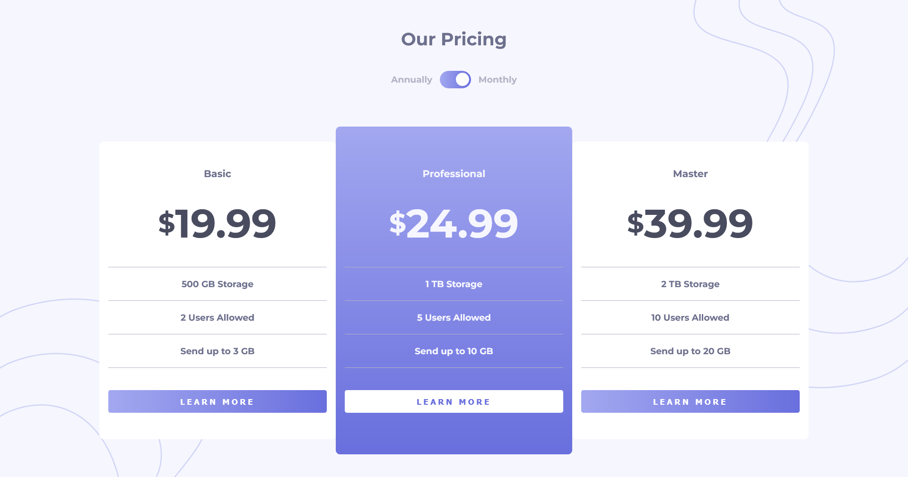

# Pricing component with toggle

This is a solution to the [Pricing component with toggle challenge on Frontend Mentor](https://www.frontendmentor.io/challenges/pricing-component-with-toggle-8vPwRMIC)

## Table of contents

- [Overview](#overview)
  - [The challenge](#the-challenge)
  - [Screenshot](#screenshot)
  - [Links](#links)
- [My process](#my-process)
  - [Built with](#built-with)
  - [What I learned](#what-i-learned)
- [Author](#author)

## Overview

### The challenge

Users should be able to:

- View the optimal layout for the component depending on their device's screen size
- Control the toggle with both their mouse/trackpad and their keyboard

### Screenshot

### Links

- Solution URL: [solution](https://your-solution-url.com)
- Live Site URL: [site](https://your-live-site-url.com)

## My process

### Built with

- Semantic HTML5 markup
- CSS custom properties
- Flexbox
- CSS Grid
- Mobile-first workflow
- SASS - (Syntactically Awesome Stylesheet)
- DOM JS

### What I learned

In this project I applied sass and the BEM methodology with the aim of achieving a reusable code and without so much repetition, although my practices are still not the best, I have achieved good results, in short I had fun and learned a lot with this project.

## Author

- Ibrahim Almeyda
- Frontend Mentor - [@IbrahimA](https://www.frontendmentor.io/profile/Ibrahim-003)

